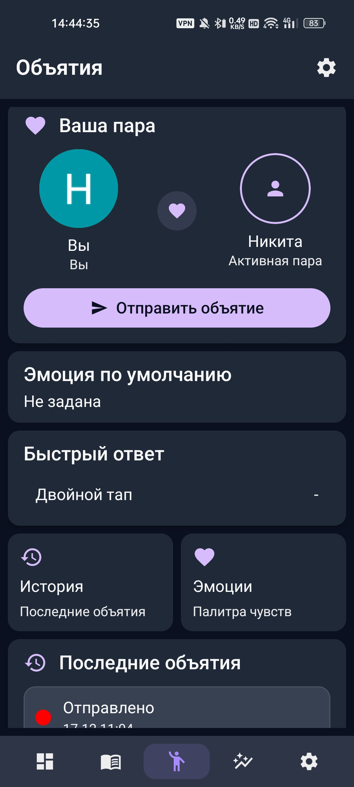
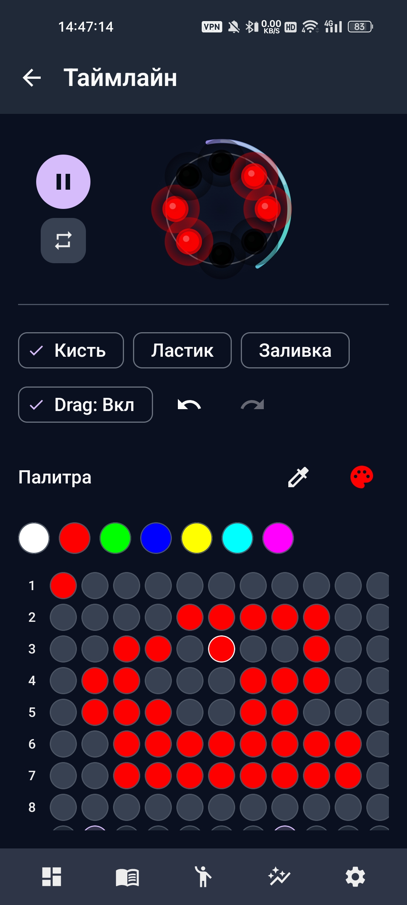

<div align="center">

# Никита Маначинский

<a href="https://git.io/typing-svg">
  
</a>

**Android Engineer** · 4 курс ЮФУ (выпуск 2026) · Ростов-на-Дону, Россия (Открыт для переезда и удаленной работы)

Ищу **стажировку / Junior** позиции.
Специализируюсь на **нативном Android**, **Kotlin Multiplatform** с  **Clean Architecture** и **Modern Android Development (MAD)**.
<br/>
Интересуют продукты со сложной бизнес-логикой и высокими требованиями к архитектуре.

<p>
  
  
  
  
  
  
  
</p>

<p>
  
  
  
  
  
  
  
</p>

[](https://github.com/nmanachinsky/nmanachinsky/blob/main/docs/Nikita_Manachinsky_Android_Dev.pdf) [](https://rostov.hh.ru/resume/f8bf939fff0ff813ee0039ed1f6d78366a314e) [](https://t.me/nikirO1) [](mailto:manachinsky88@gmail.com)
</div>

---

## 🛠 Технический Арсенал

Я не просто использую библиотеки, я понимаю, как они работают под капотом.

- **Android:** Kotlin, Jetpack Compose, Navigation, Custom Views.
- **System Design:** Clean Architecture, Multi-module (feature-api/impl), Offline-first.
- **Concurrency:** Coroutines, Flow, Channels, работа с Race Conditions.
- **Data & Network:** Room, DataStore, Retrofit, Ktor Client, WebSocket.
- **Backend & IoT:** Ktor Server, Supabase (Postgres/RLS), Docker, C/C++ (ESP32 Firmware), BLE Protocol Design.

---

## 🏆 Избранные проекты (Portfolio)

### 1️⃣ Amulet — Full-cycle IoT Ecosystem (Hardware + Android + Cloud)

> **Моя гордость.** Полный цикл разработки: от пайки железа и прошивки на С++ до мобильного приложения и бэкенда.

**Суть:** Экосистема для тактильной коммуникации на расстоянии. Устройство синхронизируется с телефоном по BLE v2.0, передает паттерны через сервер партнеру.

<div align="center">
 
<table>
  <tr>
    <td align="center"><b>Demo & BLE Sync</b><br></td>
    <td align="center"><b>Dashboard</b><br></td>
    <td align="center"><b>Interaction</b><br></td>
    <td align="center"><b>Logic Editor</b><br></td>
  </tr>
</table>

</div>

**Ключевые инженерные решения:**
- **Модульная архитектура:** `:core`, `:data`, `:feature` с четким разделением ответственности.
- **Kotlin Multiplatform:** Общая бизнес-логика вынесена в Shared модуль.
- **Сложный BLE:** Реализован собственный менеджер очереди команд (Command Queue), защита от потери пакетов, OTA-обновление прошивки.
- **Отказоустойчивость:** Offline-first подход (Outbox pattern) через WorkManager — данные уходят на сервер, когда появляется сеть.

🔗 **Ссылки:** [Android App](https://github.com/nmanachinsky/amulet_android_app) | [Backend](https://github.com/nmanachinsky/amulet_backend) | [Firmware](https://github.com/nmanachinsky/Amulet_Firmware)

---

### 2️⃣ P2P Analytics Platform — Data Engineering & Infrastructure

 **Тип:** Инфраструктурный Big Data проект
 
 Разработка и деплой платформы для сбора, обработки и анализа данных. Проект демонстрирует навыки работы со сложными распределенными системами и контейнеризацией.
 
 <div align="center">
 
 
 
 
 
 
 
 
 
 
 </div>
 
 <details>
 <summary><b>Схема архитектуры (Mermaid)</b></summary>
 
 ```mermaid
 graph TD
     subgraph Источник Данных
         A[PostgreSQL] --> B{HDFS - Landing Zone};
     end
 
     subgraph ETL-пайплайн на Spark
         B --> C[Delta Lake - Bronze];
         C --> D[Delta Lake - Silver];
         D --> E{DQ Checks};
         E -- OK --> F[Delta Lake - Gold Витрины];
         F --> G[BI-аналитика];
         D --> H[ML Scoring];
     end
 
     subgraph MLOps-цикл
         I[JupyterLab] --> J(MLflow Server);
         J --> K[MinIO S3];
         J --> L[PostgreSQL MLflow];
         J --> H;
     end
 
     subgraph Аналитика и Визуализация
         H --> M[Delta Lake - Predictions];
         G(Apache Superset) --> F;
         G --> M;
     end
 
     style A fill:#D6EAF8,stroke:#333,stroke-width:2px
     style G fill:#D5F5E3,stroke:#333,stroke-width:2px
     style I fill:#FCF3CF,stroke:#333,stroke-width:2px
 ```
 
 </details>
 
 - **Задачи:** Настройка ETL-пайплайнов, оркестрация процессов, организация Data Lake.
 - **Стек:** Docker Compose, Apache Airflow, Apache Spark, HDFS, PostgreSQL, MinIO.
 - **Результат:** Реализована "Медальонная архитектура" (Bronze/Silver/Gold layers), обеспечивающая полный цикл жизни данных от сырого вида до BI-витрин.

🔗 **Репозиторий:** [github.com/BUka228/p2p-analytics-platform](https://github.com/nmanachinsky/p2p-analytics-platform)

---

### 3️⃣ ProgressQuest — Productivity & Gamification

Классическое Android-приложение, демонстрирующее **Clean Architecture** и **Modern Android Development (MAD)**.

- **UI:** 100% Jetpack Compose + Material 3.
- **Tech:** Hilt, Room, Firebase (Auth, Cloud Functions).
- **Фича:** Геймификация задач (RPG-система) с синхронизацией в реальном времени.

🔗 **Репозиторий:** [github.com/BUka228/ProgressQuest](https://github.com/nmanachinsky/ProgressQuest)

---

## 📈 GitHub Stats

<div align="center">


</div>
